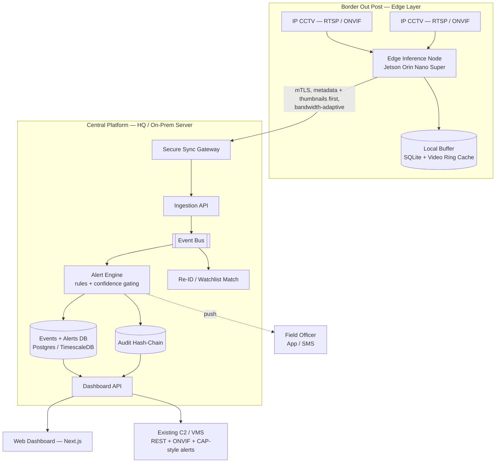

# IBVAP — Intelligent Border Video Analytics Platform
**Development Architecture Document**
SIH 2026 · Problem Statement 26187 · Ministry of Home Affairs — Sashastra Seema Bal (SSB)

---

## 1. Overview & Design Philosophy

IBVAP turns existing IP-based CCTV at Border Out Posts (BOPs) into an AI-driven surveillance network — no dedicated FRS/ANPR/smart-camera hardware required. Three design principles drive every decision below, because they are what separate this build from a generic "YOLO + dashboard" submission:

1. **Edge-first, offline-resilient.** BOPs have unreliable connectivity. Every capability must work locally on the camera-side node and degrade gracefully — never depend on a live link to HQ to detect or log an event.
2. **Tamper-evident by design.** The assigned theme is *Blockchain & Cybersecurity*, not just Software. Every alert and piece of evidence is chained and hashable so its integrity can be verified later — a first-class feature, not an afterthought.
3. **Human-in-the-loop, low false-positive.** India's existing border-sensor programs have struggled specifically with alert fatigue from wildlife, weather and vegetation triggering false positives. IBVAP treats false-positive suppression as a measurable, designed-for requirement.

---

## 2. System Architecture



**Edge Layer** (per BOP): ingests camera streams, runs all real-time inference, evaluates virtual-fence and activity rules locally, buffers everything to disk, syncs opportunistically.
**Transport**: mutually-authenticated TLS tunnel; metadata + thumbnails sync first (kilobytes), full clips sync later when bandwidth allows.
**Core Platform**: aggregates events from every BOP, runs the heavier cross-camera jobs (re-identification, watchlist matching), owns the audit ledger, serves the dashboard.
**Application Layer**: the operator-facing web dashboard and any outbound integration to command-and-control systems already in use.

---

## 3. Technology Stack

| Layer | Choice | Why |
|---|---|---|
| Edge / core inference | Python 3.11, PyTorch, ONNX Runtime / TensorRT | Native ecosystem for every CV model below; TensorRT gets real-time speed on Jetson |
| Detection | `ultralytics` (YOLO26n/s) | Current-generation, edge-optimized, NMS-free Ultralytics release; simplest path to a working demo. Ships AGPL-3.0 — fine for a hackathon, but flag it on the roadmap slide as a licensing item to resolve (Ultralytics Enterprise license, or swap to Apache-2.0 RF-DETR) before any real deployment |
| Tracking | ByteTrack (default) / BoT-SORT (PTZ or crowded scenes) | Both ship inside `ultralytics.track()` — toggle by config, no extra dependency |
| Face detect + recognition | `insightface` (SCRFD + ArcFace) | Single well-maintained package, strong accuracy/speed trade-off on edge hardware |
| ANPR | YOLO26n (plate class) + PaddleOCR / fast-plate-ocr | Standard, battle-tested combination; add regex validation for Indian plate format and multi-frame voting |
| Night enhancement | Zero-DCE / Zero-3DCE | Zero-reference (no paired training data needed), real-time, validated in recent literature specifically for nighttime surveillance ahead of a YOLO detector |
| Backend services | Python, FastAPI (async) | One language across edge and core keeps a small team fast; auto-generated OpenAPI docs double as a machine-readable contract |
| Database | PostgreSQL + TimescaleDB extension | Relational integrity for alerts/users/zones, time-series performance for high-volume detection events |
| Message bus | Redis Streams (hackathon) → Kafka (production note) | Redis is enough to demo the pipeline in 36 hours; Kafka is the documented upgrade path for real multi-BOP scale |
| Object storage | MinIO (S3-compatible) | Evidence clips/thumbnails, self-hostable at HQ, no cloud dependency |
| Audit ledger | Custom hash-chain service (see §11) | Realistically buildable in a hackathon and still proves the tamper-evidence concept; Hyperledger Fabric noted as the production path |
| Frontend | Next.js, TypeScript, Tailwind CSS | Matches the team's existing frontend stack; WebSocket client for live alerts, Leaflet for the camera/alert map |
| Edge runtime | Docker Compose, NVIDIA JetPack | Reproducible edge deployment on Jetson Orin Nano Super (~$249, 67 TOPS) or any CUDA mini-PC |
| Auth | JWT + role-based access control | Roles: Field Officer, Post Commander, HQ Analyst, Admin |

---

## 4. Repository Structure

```
ibvap/
├── edge/
│   ├── ingestion/            # RTSP/ONVIF camera capture
│   ├── inference/
│   │   ├── detection/        # YOLO26 human + vehicle
│   │   ├── tracking/         # ByteTrack / BoT-SORT
│   │   ├── face/              # SCRFD + ArcFace
│   │   ├── anpr/              # plate detect + OCR + validation
│   │   ├── night_enhance/     # Zero-DCE pre-processing
│   │   └── activity/          # rule-based behaviour engine
│   ├── fence/                 # homography calibration + zone rules
│   ├── buffer/                 # local SQLite + video ring buffer
│   ├── sync_agent/             # bandwidth-aware uplink to core
│   └── docker-compose.edge.yml
├── core/
│   ├── ingestion_api/          # receives edge sync payloads
│   ├── alert_engine/           # rules → alerts, dedup, severity
│   ├── reid_service/           # cross-camera re-identification
│   ├── watchlist_service/      # FRS/ANPR match against watchlists
│   ├── audit_chain/            # hash-chain ledger service
│   ├── dashboard_api/          # REST + WebSocket for the frontend
│   ├── integration_gateway/    # ONVIF / CAP / REST bridge to C2 & VMS
│   ├── auth/                    # RBAC, JWT
│   └── docker-compose.core.yml
├── web/
│   └── dashboard/                # Next.js + TypeScript + Tailwind
├── ml/
│   ├── datasets/
│   ├── training_notebooks/
│   └── model_registry/
├── docs/
│   ├── architecture.md           # this document
│   ├── api_contracts.md
│   └── demo_script.md
└── infra/
    └── docker-compose.dev.yml
```

---

## 5. Core Services

| Service | Responsibility | Runs at |
|---|---|---|
| `ingestion` | Pull RTSP/ONVIF streams, hand frames to inference | Edge |
| `detection` | Human + vehicle bounding boxes per frame | Edge |
| `tracking` | Assign/maintain track IDs, ground-point projection | Edge |
| `face` | Detect faces in person crops, embed, optional watchlist match | Edge (detect) / Core (match) |
| `anpr` | Plate detect, OCR, format-validate, temporal vote | Edge |
| `night_enhance` | Low-light pre-processing gate before detection | Edge |
| `fence` | Homography-calibrated polygon/line-crossing + dwell rules | Edge |
| `activity` | Loitering, crawling, sprinting, group-forming heuristics | Edge |
| `sync_agent` | Batches + prioritizes what leaves the BOP under bandwidth limits | Edge |
| `ingestion_api` | Accepts edge payloads, writes canonical events | Core |
| `alert_engine` | Confidence gating, deduplication, severity assignment | Core |
| `reid_service` | Cross-camera person/vehicle re-identification | Core |
| `watchlist_service` | Face/plate match against watchlists, logs every query | Core |
| `audit_chain` | Appends, hashes, and verifies the tamper-evident ledger | Core |
| `dashboard_api` | REST + WebSocket for the web dashboard | Core |
| `integration_gateway` | Outbound alerts to existing C2/VMS, ONVIF camera discovery | Core |

---

## 6. Data Models

**Camera** — id, name, bop_id, lat, lng, rtsp_url, onvif_profile, homography_matrix, is_ptz, status

**Track** — track_id, camera_id, object_class, first_seen, last_seen, ground_point_path, confidence, reid_embedding_ref

**DetectionEvent** — id, camera_id, track_id, type (human / vehicle / face / plate / fence_breach / activity / night_motion), confidence, timestamp, thumbnail_ref, clip_ref, geo, metadata (jsonb)

**Alert** — id, event_ids[], severity (low / medium / high / critical), status (new / acknowledged / resolved / false_positive), assigned_to, created_at, resolved_at, notes

**Zone (Virtual Fence)** — id, camera_id, polygon_points_pixel, polygon_points_geo, rule_type (line_cross / dwell / direction), name

**AuditRecord** — id, event_id, record_hash, prev_hash, merkle_root_ref, timestamp, signer

**WatchlistEntry** — id, type (face / plate), reference_embedding_or_hash, category, source_agency, added_at

**User** — id, name, role (field_officer / post_commander / hq_analyst / admin), bop_id, auth_provider_id

---

## 7. API & Real-Time Contracts

| Method | Path | Purpose |
|---|---|---|
| POST | `/api/v1/edge/sync` | Edge node pushes a batch of events + heartbeat |
| GET | `/api/v1/cameras` | List cameras and status |
| POST | `/api/v1/cameras/{id}/calibrate` | Upload homography reference points |
| GET | `/api/v1/alerts` | Filter by status, severity, camera, time range |
| PATCH | `/api/v1/alerts/{id}` | Acknowledge / resolve / mark false positive |
| GET | `/api/v1/events/{id}/clip` | Signed URL to the evidence clip |
| GET | `/api/v1/audit/{event_id}/verify` | Re-computes and verifies the hash chain for one event |
| POST | `/api/v1/watchlist` | Add a watchlist entry (admin only, logged) |
| GET/POST | `/api/v1/zones` | Read/write virtual-fence definitions |
| WS | `/ws/alerts` | Live alert stream, subscribe by BOP or all |
| POST | `/api/v1/integrations/c2/webhook` | Outbound alert delivery to existing C2/VMS |

---

## 8. Capability Pipelines

Mapped directly to the eight capabilities the problem statement asks for:

| # | Requirement | Pipeline | Models / Libraries | Build phase |
|---|---|---|---|---|
| 1 | Human detection & tracking | frame → detect(person) → track → ground-point project | YOLO26n, ByteTrack | Phase 1 |
| 2 | Vehicle detection & classification | frame → detect(car/truck/bus/motorcycle) → track | YOLO26n/s, BoT-SORT | Phase 1 |
| 3 | Face detection | person crop → detect face → (optional) embed → watchlist match | SCRFD, ArcFace | Phase 2 |
| 4 | ANPR | vehicle crop → detect plate → OCR → validate format → vote across frames | YOLO26n, PaddleOCR | Phase 2 |
| 5 | Virtual fence intrusion | ground-point → homography → polygon/line test → dwell rule | OpenCV homography | Phase 1 |
| 6 | Suspicious activity | track + pose features → rule engine (loiter / crawl / sprint / group) | MediaPipe Pose, rule engine | Phase 3 |
| 7 | Night-time movement | luminance check → Zero-DCE enhance → detect → motion-diff fallback | Zero-DCE / Zero-3DCE | Phase 2 |
| 8 | Real-time alerts & logging | event → confidence gate → dedup → alert → hash-chain append → push | FastAPI, Postgres, WebSocket | Phase 1 |

---

## 9. Night-Time Detection Strategy

The hardest requirement, since the brief specifies *standard* CCTV — no thermal or dedicated night-vision hardware.

1. **Cheap signal first**: compute mean frame luminance every N frames. Below threshold, route through enhancement before detection instead of always running it (saves edge compute).
2. **Zero-DCE / Zero-3DCE enhancement**: a lightweight, zero-reference curve-estimation network that brightens frames without needing paired day/night training data — the 3D variant adds temporal consistency across consecutive frames, which matters for video rather than single images.
3. **Confidence-aware fallback**: if the detector still returns low confidence after enhancement (heavy darkness, camera IR range exceeded), fall back to frame-differencing motion detection and raise a lower-severity "unclassified movement — needs verification" alert rather than staying silent or guessing a class.
4. **Extensibility note (not core scope)**: if a BOP later adds a low-cost thermal module (e.g. FLIR Lepton), the architecture accepts it as a second camera feed into the same fusion pipeline — worth one slide as production roadmap, not something to build in 36 hours.

---

## 10. Virtual Fence & Geo-Calibration

A naive pixel-space line-crossing rule breaks down on long-range, oblique CCTV angles — a person 200m away crosses far fewer pixels per meter than one 20m away. IBVAP calibrates each camera once with 4+ known reference points to compute a homography matrix, then:

- Projects each track's **ground-contact point** (bottom-center of the bounding box, not the box center) through the homography to a real-world plane.
- Defines virtual fences as **geo-referenced polygons/lines**, not pixel coordinates — so the same rule logic works correctly regardless of camera distance or angle.
- Supports dwell-time and direction-of-travel rules on top of simple crossing, since a person moving parallel to the fence shouldn't alert the same way as one crossing it.

---

## 11. Tamper-Evident Audit Trail

The direct answer to the *Blockchain & Cybersecurity* theme tag — most competing teams will treat this PS as pure computer vision and miss it entirely.

- Every event/alert is serialized to canonical JSON and SHA-256 hashed.
- Each new record's hash includes the previous record's hash (a hash chain — the same core primitive a blockchain uses), so altering any past record breaks every hash after it.
- Roots are Merkle-batched periodically and can be anchored externally (a public timestamping service, or a small permissioned multi-node ledger across BOP + HQ) for stronger tamper evidence.
- `GET /api/v1/audit/{event_id}/verify` recomputes the chain and returns pass/fail — this doubles as a **live demo moment**: show an alert, show its hash, edit the underlying database row directly, then show verification fail.
- **Production note**: Hyperledger Fabric (permissioned blockchain across BOP + HQ nodes) is the natural upgrade path once the platform needs multi-party consensus across chains of command — call this out as a roadmap slide rather than attempting it in 36 hours.

---

## 12. Security Architecture & Threat Model

Each layer of the architecture is treated as a discrete attack surface. This is not hypothetical: in December 2025, CISA disclosed a critical (CVSS 9.3) unauthenticated-access flaw (CVE-2025-13607) in CCTV cameras from three India-based manufacturers (D-Link India, Sparsh Securitech, Securus), and a further India-deployed Honeywell CCTV account-takeover flaw (CVE-2026-1670) was disclosed in March 2026. The camera is standard, internet-capable, third-party hardware nobody on the team controls the firmware of — it is the single most realistic entry point in the whole system and is designed for accordingly.

### 12.1 Camera layer — assume compromise, contain the blast radius
- Threat: default/unchanged credentials, internet-exposed admin interfaces, unpatched firmware CVEs (as above), a frozen/looped feed pushed back to blind a post during an actual crossing.
- Controls: cameras isolated on a dedicated VLAN with no route to anything but the edge node; camera admin interfaces firewalled off outside a one-time provisioning step; credentials rotated at provisioning as an auditable checklist item; `firmware_version`/`last_patched` added to the Camera model (§6) and surfaced on the dashboard; frame-replay/freeze detection on the edge node (anomalous frame-hash repetition, missing expected sensor noise); prefer cameras on MHA's own Essential Requirements / STQC-certified list where procurement allows — citing that list in the pitch shows the team checked.

### 12.2 Network / transport — camera ↔ edge ↔ core
- Threat: MITM from a compromised camera or LAN position; link flooding/jamming timed to create a blind window during an actual intrusion.
- Controls: mTLS with certificate pinning (not just CA trust) between edge and core; the local-first design (§13) already absorbs an uplink DDoS — a jammed link delays sync, it doesn't blind the post; rate-limiting and anomaly alerting on the edge node's own inference pipeline, not just the network link.

### 12.3 Edge node — physical box at the post
- Threat: physical access at a remote, lightly-staffed location; a compromised camera pivoting inward; a poisoned software/model update.
- Controls: full-disk encryption; secure boot, signed containers and signed model weights only; no inbound ports reachable except a physically-present provisioning flow (remote-reachability is exactly what made the CVEs above "trivial for remote attackers"); tamper-evident enclosure flagged as a hardware/ops requirement even where it sits outside a software team's build scope.

### 12.4 Core platform, APIs, dashboard
- Threat: the standard web-app playbook — weak/long-lived auth, IDOR across BOPs, injection, leaked secrets.
- Controls: short-lived JWTs with enforced expiry and refresh, signing secret in a proper secrets manager; every API call re-validates the caller's BOP/role scope server-side, not just at login; parameterized queries and boundary input validation throughout; the watchlist/FRS-match endpoint specifically rate-limited with every query logged as its own audit record (§6, §11) — defends against misuse by an authorized user as much as an external attacker.

### 12.5 The AI models themselves
- Threat: adversarial patches — a printed pattern worn or carried can suppress a detector's confidence below alert threshold. This is published, real research on physical adversarial-patch attacks against person detectors, directly relevant to a border-crossing context — not theoretical.
- Controls: never gate purely on the detector's own confidence score — cross-check against the non-ML motion-differencing signal already used for the night-time fallback (§9); a mismatch (motion present, detector silent) is itself worth a lower-severity "unclassified activity" alert; a lightweight, largely training-free patch/style-removal pass ahead of the main detector is realistic to prototype in the hackathon window and reflects current (2026) defense research.

### 12.6 The audit chain — attacking the thing meant to prove nothing was tampered with
- Threat: an attacker with root/DB access at core who also controls the hashing service could, in principle, rewrite history and recompute a self-consistent fake chain.
- Controls: the chain-signing key must not be reachable by the same service account that holds write access to the underlying event data; periodic external anchoring of the Merkle root (even a simple publish-outside-your-own-infrastructure step) is what makes tampering detectable rather than merely implausible — the concrete version of the production note in §11.

### 12.7 Supply chain
- Threat: a poisoned dependency, or a "pre-fine-tuned for surveillance" model checkpoint from a public hub that is actually trojaned.
- Controls: pinned dependency versions/hashes (lockfiles, never `latest` in builds); model weights only from the original verified source (Ultralytics/InsightFace releases or the team's own training run) — never an unverified third-party checkpoint.

### 12.8 Insider misuse
- Threat: the most likely misuse of an FRS/ANPR system is an authorized user running an unauthorized lookup, not an external hacker.
- Controls: every watchlist query already logs who searched whom and when (§6, §11); surface this on an admin-only audit view so misuse is visible, not just theoretically logged.

### 12.9 Data protection & compliance
- Recognized plate numbers stored as salted HMAC-SHA256 hashes, not plaintext (§6); plaintext resolvable only through an authorized, logged lookup — aligned with the **DPDP Act, 2023** (Rules notified November 2025, phased enforcement through 2027) consent- and purpose-limitation principles.
- Configurable, purpose-limited retention windows per data category (raw video shortest, confirmed-alert evidence longest).

---

## 13. Deployment Topology & Offline Resilience

- **Edge node per BOP**: Jetson Orin Nano Super (~$249, 67 TOPS, 7–25W) or any CUDA-capable mini-PC, running the `edge/` Docker Compose stack.
- **Local-first**: all inference and rule evaluation happens on-device; nothing needs a live link to detect or log an event.
- **Store-and-forward sync**: metadata + thumbnails sync first (small, cheap over degraded links); full video clips sync opportunistically when bandwidth allows; a local ring buffer retains raw video for a configurable window (e.g. 72 hours) even fully offline.
- **Graceful degradation**: if GPU inference fails, the node falls back to motion-only alerting rather than going dark.
- **Core platform**: containerized, deployable on an on-prem HQ server or a private cloud — never a hard dependency on public internet reachability from the border post itself.

---

## 14. Integration with Existing Systems

- **Camera onboarding**: ONVIF Profile S/T discovery + RTSP ingestion — works with *any* standards-compliant existing CCTV, which is the core ask of the problem statement (no proprietary hardware).
- **Outbound alerts**: structured in a CAP-like (Common Alerting Protocol) schema over REST/webhook, so IBVAP can hand off to whatever command-and-control or VMS a post already runs, instead of requiring a bespoke integration per system.
- **Positioning relative to CIBMS**: India's Comprehensive Integrated Border Management System already combines CCTV, radar, underground sensors and laser walls into a "smart fence," and its documented implementation challenge has been fusing heterogeneous sensor feeds into one picture while keeping false positives (wildlife, weather, vegetation) low. IBVAP is scoped as the **software analytics layer specifically for the CCTV tier** of that broader picture — it doesn't compete with CIBMS, it makes the camera layer smarter and feeds a common, low-noise alert format upstream. State this explicitly in the pitch; it shows the team understands the real operating environment, not just the PS text.

---

## 15. Datasets & Model Strategy

No official dataset was provided with the problem statement, so the prototype trains/validates on public data and the team's own captured footage:

| Capability | Suggested source |
|---|---|
| Human / vehicle detection | COCO (person, car, truck, bus, motorcycle classes); VisDrone for oblique, pole-height camera angles closer to real CCTV |
| Face detection | WIDER FACE |
| ANPR | Search Roboflow Universe / Kaggle for "Indian license plate detection" — several community-labeled sets exist; supplement with self-captured plate photos in Indian format for the demo |
| Night-time detection | ExDark (Exclusively Dark Image Dataset); NTIRE low-light-enhancement challenge data |
| Tracking / Re-ID sanity checks | MOT17 / MOT20; Market-1501 for person re-identification embeddings |
| Suspicious activity | No good public fit for this niche — self-record short clips (normal walking vs. loitering vs. crawling vs. running vs. group-forming) for a controllable, honest demo rather than an unlicensed "crime dataset" |

---

## 16. Non-Functional Targets

- Per-stream detection latency: < 200 ms/frame on the edge node
- Alert-to-dashboard latency: < 2 s on a connected link
- Local offline buffer: ≥ 72 hours of raw video per camera
- Core platform: horizontally scalable per-BOP (stateless services behind the event bus)
- Graceful degradation, never silent failure, at every layer

---

## 17. Phased Build Plan (Hackathon Scope)

**Phase 0 — Setup**: repo scaffold, `docker-compose` skeletons, camera simulation (recorded clips / public test RTSP streams standing in for real CCTV), FastAPI service shells, Next.js dashboard shell.

**Phase 1 — Core loop (must work live)**: ingestion → YOLO26 detection → ByteTrack → virtual-fence rule → alert → stored event → dashboard shows live feed, alert list, and a map pin. This is the non-negotiable demo backbone.

**Phase 2 — Differentiators**: night-enhancement toggle (before/after side-by-side), ANPR on a sample vehicle clip, face detection with a privacy-safe blurred overlay, and the hash-chain audit trail with the live tamper/verify demo from §11.

**Phase 3 — Depth (as time allows)**: suspicious-activity rule demo (loitering/crawling), cross-camera re-identification, ONVIF/C2 integration mock, and the offline-resilience demo — kill the edge node's network, show local buffering continue, restore the link, show sync catch-up. Both demos in this phase are highly visual and memorable for judges.

**Phase 4 — Polish**: metrics panel (FPS, latency, running false-positive count), README, pitch-deck alignment, demo script rehearsal.

---

## 18. Suggested Team Role Mapping (6-member SIH team)

| Role | Owns |
|---|---|
| Edge/CV Lead | Detection, tracking, night enhancement |
| ANPR + Face Lead | Plate and face pipelines |
| Backend/Platform Lead | FastAPI services, database, event bus, audit chain |
| Frontend Lead | Next.js dashboard |
| Integration/DevOps | Docker, ONVIF/C2 gateway, offline-sync, deployment |
| Research/Presentation Lead | Dataset curation, PPT, demo script, judge Q&A prep |

---

## 19. Assumptions & Open Questions

- No dataset or sample footage was provided with PS 26187 — the plan above assumes public datasets + self-captured clips for the prototype.
- Cameras are assumed visible-spectrum only (no thermal) per "existing CCTV infrastructure" in the brief; thermal fusion is noted as future scope, not core scope.
- Team size assumed at 6 (standard SIH team size) — adjust the role mapping in §18 if different.
- Connectivity at BOPs is assumed intermittent/low-bandwidth, driving the edge-first design in §13; if the real target sites have reliable links, some of that complexity could be simplified — but it's safer to over-design for the harder case.

---

## 20. References

- Ultralytics YOLO tracking modes (ByteTrack/BoT-SORT): docs.ultralytics.com/modes/track
- InsightFace SCRFD + ArcFace: insightface.ai
- Zero-DCE / low-light enhancement research: NTIRE low-light-enhancement challenge series
- NVIDIA Jetson Orin Nano Super: developer.nvidia.com/buy-jetson
- CIBMS background: mha.gov.in — Border Management-I Division
- DPDP Act 2023 / DPDP Rules 2025 status: tracked at cadp.in and judicio.ai implementation trackers
- CISA ICS Advisory ICSA-25-343-03 (India-based CCTV camera vulnerability, CVE-2025-13607): cisa.gov/news-events/ics-advisories/icsa-25-343-03
- Adversarial patch attacks on object detectors: Brown et al., "Adversarial Patch" (2017); current defenses e.g. AntiStyler (CVPR 2026)
- MHA Model Technical Specifications/Guidelines for CCTV/VSS and Essential Requirements certification (referenced via MeitY/MHA advisory on VSS procurement)

---

*Document version 1.0 — prepared for implementation planning.*
